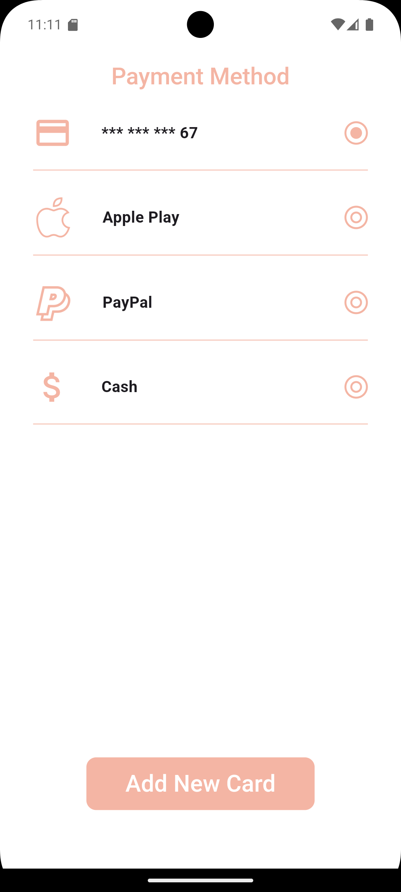
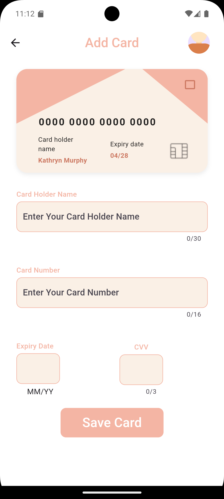

<!DOCTYPE html>
<html lang="en">
<!-- <head>
 
  
</head> -->
<body>

  <h1>💳 Payment Module using Flutter + GetX + Firebase + MVVM</h1>

  

    This is a Flutter payment module built using GetX for state management and Firebase for backend. The project follows MVVM architecture for maintainability and scalability.
  

  <h2>🎯 Objective</h2>
  

    The project includes:
  

  <ul>
    <li><strong>Payment Methods Screen</strong>: Display existing payment methods.</li>
    <li><strong>Add Card Screen</strong>: Enter card details with live preview and save to Firebase.</li>
  </ul>

  <h2>📱 Screens Overview</h2>

  <h3>1. Payment Methods Screen</h3>
  

    Shows a list of saved payment options and includes a button to navigate to the Add Card screen.
  

  

  <h3>2. Add Card Screen</h3>
  

    Allows the user to input card details with instant live preview and upload profile image.
  

  

  <h2>⚙️ Technologies Used</h2>
  <ul>
    <li>Flutter</li>
    <li>GetX (State management + Routing)</li>
    <li>Firebase Firestore & Storage</li>
    <li>MVVM Architecture</li>
  </ul>

  <h2>🧱 Project Structure</h2>
  <ul>
    <li><code>model/</code> – Data classes</li>
    <li><code>view/</code> – UI screens</li>
    <li><code>view_model/</code> – Business logic controllers</li>
    <li><code>data/repo/</code> – Firebase interaction</li>
    <li><code>core/utils/</code> – Constants and styles</li>
    <li><code>components/</code> – Reusable widgets</li>
  </ul>

  <h2>🛠 How to Run the Project</h2>
  <ol>
    <li>Ensure Flutter is installed and configured on your machine.</li>
    <li>Clone the project using:
       <code>git clone https://github.com/your-username/payment_module.git</code>
    </li>
    <li>Navigate to the project directory: <code>cd payment_module</code></li>
    <li>Run <code>flutter pub get</code> to fetch dependencies.</li>
    <li>Connect your emulator or physical device.</li>
    <li>Run the project: <code>flutter run</code></li>
  </ol>

  <h2>♻️ Features</h2>
  <ul>
    <li>MVVM pattern for clean code structure</li>
    <li>GetX for reactive state and routing</li>
    <li>Live card preview UI</li>
    <li>Profile image upload to Firebase Storage</li>
    <li>Firestore integration to store cards</li>
  </ul>

  <h2>📌 Notes</h2>
  <ul>
    <li>User authentication is not required.</li>
    <li>Dummy Firebase data can be used for testing.</li>
    <li>Code is commented and easy to maintain.</li>
  </ul>

  <h2>💬 Final Words</h2>
  

    This task was an opportunity to demonstrate real-time UI updates, Firebase integration, and clean architecture. Thank you for reviewing.
  

</body>
</html>
